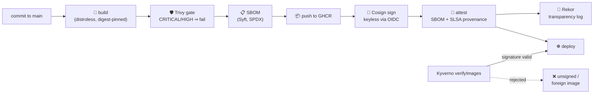

# Container Supply Chain Security — build, attest, verify

[](https://github.com/alice101-dev/supply-chain-secure-build/actions/workflows/ci.yml)

An end-to-end **secure software supply chain** on GitHub Actions: every image
that leaves this repo carries an SBOM, has passed a vulnerability gate, is
**signed keyless** (no signing keys exist, anywhere), ships **SLSA build
provenance** — and a Kyverno policy makes Kubernetes **reject anything else**
at admission.



## What the pipeline enforces

| Stage | Tool | Guarantee |
| --- | --- | --- |
| Build | Docker multi-stage → distroless/static | no shell, no package manager, ~2 MB attack surface; base images pinned by digest |
| Vulnerability gate | Trivy | CRITICAL/HIGH with an available fix ⇒ the image is **never published** |
| Inventory | Syft | SPDX SBOM generated and attached to the image as a signed attestation |
| Signing | Cosign **keyless** | GitHub OIDC proves *which repo & workflow* built it; Fulcio issues a short-lived cert; the signature is logged in Rekor. **No key to store, rotate, or leak** |
| Provenance | GitHub Attestations (SLSA) | signed statement of the exact commit, workflow, and runner that produced the image |
| Admission | Kyverno `verifyImages` | the cluster **fails closed**: only images signed by this repo's CI are schedulable; tags are mutated to verified digests |

PRs run the build + Trivy + SBOM gates only; nothing is published or signed
until the commit lands on `main`.

## Verify it yourself

Anyone can verify the image — that's the point of keyless + transparency logs:

```bash
IMAGE=ghcr.io/alice101-dev/supply-chain-secure-build:latest

# Signature: was this built by THIS repo's workflow?
cosign verify \
  --certificate-identity-regexp '^https://github.com/alice101-dev/supply-chain-secure-build/\.github/workflows/.*' \
  --certificate-oidc-issuer https://token.actions.githubusercontent.com \
  "$IMAGE"

# SBOM: what exactly is inside?
cosign verify-attestation --type spdxjson \
  --certificate-identity-regexp '^https://github.com/alice101-dev/supply-chain-secure-build/\.github/workflows/.*' \
  --certificate-oidc-issuer https://token.actions.githubusercontent.com \
  "$IMAGE" | jq -r '.payload' | base64 -d | jq '.predicate.packages[].name'

# Provenance: which commit, which workflow, which runner?
gh attestation verify oci://$IMAGE --repo alice101-dev/supply-chain-secure-build
```

## Enforce it in a cluster

```bash
# Requires Kyverno (https://kyverno.io) installed in the cluster
kubectl apply -f k8s/kyverno-verify-image-signature.yaml

# This deploys fine — the image is signed by this repo's CI:
kubectl apply -f k8s/deployment.yaml

# This is REJECTED at admission — unsigned image:
kubectl run bad --image=nginx:latest
```

The policy fails **closed** (`failurePolicy: Fail`) and rewrites tags to the
verified digest (`mutateDigest`), so even `:latest` deploys are reproducible.

## Repository layout

```
.
├── .github/workflows/ci.yml                  # the pipeline (build→scan→SBOM→sign→attest→verify)
├── Dockerfile                                # multi-stage, distroless, digest-pinned
├── main.go                                   # deliberately boring demo service
└── k8s/
    ├── kyverno-verify-image-signature.yaml   # admission: only OUR signatures pass
    └── deployment.yaml                       # hardened example consumer
```

## Related

- [terraform-pr-gates](https://github.com/alice101-dev/terraform-pr-gates) — the same
  shift-left philosophy applied to Terraform PRs.
- [gke-pgbouncer-hardened](https://github.com/alice101-dev/gke-pgbouncer-hardened) — the
  runtime-hardening counterpart of the images this pipeline produces.
