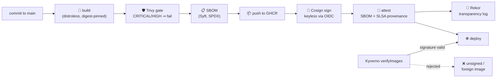

# Container Supply Chain Security — build, attest, verify

[](https://github.com/alice101-dev/supply-chain-secure-build/actions/workflows/ci.yml)

## Why this matters

Modern breaches increasingly skip your firewall and walk in through the
**build pipeline**. The attack doesn't have to come from outside:

- **A malicious insider** (or one stolen laptop / CI token) builds an image
  with a backdoor and `kubectl apply`s it straight to production — no review,
  no scan, no trace of where the binary came from.
- **A poisoned dependency** — one `go get` of a typosquatted or compromised
  package (the xz-utils / event-stream / SolarWinds pattern) and the backdoor
  is compiled into your binary *by your own CI*, signed off by nobody.
- **A rogue image** — retagged, tampered, or pulled from an unvetted registry —
  lands in the cluster because Kubernetes, by default, **runs whatever it is
  told to run**. `image: attacker/nginx:latest` schedules just as happily as
  yours.

The common thread: without provenance, signatures, and admission-time
verification, the cluster cannot tell *your* build from an attacker's. This
repo closes that gap end to end — an **SBOM** for every image, a
**vulnerability gate** before publish, **keyless signing** that cryptographically
ties the image to *this repo's CI workflow* (an insider can't reproduce it from
a laptop), **SLSA provenance** recording exactly which commit and runner built
it, and a **Kyverno policy** that makes Kubernetes reject anything unsigned,
unscanned, or built anywhere else.



## What the pipeline enforces

| Stage | Tool | Guarantee |
| --- | --- | --- |
| SAST | Semgrep CE (`p/golang`, `p/gosec`, `p/cwe-top-25`) | insecure code patterns fail the build before anything is compiled |
| Build | Docker multi-stage → distroless/static | no shell, no package manager, ~2 MB attack surface; base images pinned by digest |
| Vulnerability gate | Trivy | CRITICAL/HIGH with an available fix ⇒ the image is **never published** |
| Inventory | Syft | SPDX SBOM generated and attached to the image as a signed attestation |
| Signing | Cosign **keyless** | GitHub OIDC proves *which repo & workflow* built it; Fulcio issues a short-lived cert; the signature is logged in Rekor. **No key to store, rotate, or leak** |
| Provenance | GitHub Attestations (SLSA) | signed statement of the exact commit, workflow, and runner that produced the image |
| Admission | Kyverno `verifyImages` | the cluster **fails closed**: only images signed by this repo's CI are schedulable; tags are mutated to verified digests |

PRs run the build + Trivy + SBOM gates only; nothing is published or signed
until the commit lands on `main`.

## Verify it yourself

Anyone can verify the image — that's the point of keyless + transparency logs:

```bash
IMAGE=ghcr.io/alice101-dev/supply-chain-secure-build:latest

# Signature: was this built by THIS repo's workflow?
cosign verify \
  --certificate-identity-regexp '^https://github.com/alice101-dev/supply-chain-secure-build/\.github/workflows/.*' \
  --certificate-oidc-issuer https://token.actions.githubusercontent.com \
  "$IMAGE"

# SBOM: what exactly is inside?
cosign verify-attestation --type spdxjson \
  --certificate-identity-regexp '^https://github.com/alice101-dev/supply-chain-secure-build/\.github/workflows/.*' \
  --certificate-oidc-issuer https://token.actions.githubusercontent.com \
  "$IMAGE" | jq -r '.payload' | base64 -d | jq '.predicate.packages[].name'

# Provenance: which commit, which workflow, which runner?
gh attestation verify oci://$IMAGE --repo alice101-dev/supply-chain-secure-build
```

## Enforce it in a cluster

```bash
# Requires Kyverno (https://kyverno.io) installed in the cluster
kubectl apply -f k8s/kyverno-verify-image-signature.yaml

# This deploys fine — the image is signed by this repo's CI:
kubectl apply -f k8s/deployment.yaml

# This is REJECTED at admission — unsigned image:
kubectl run bad --image=nginx:latest
```

The policy fails **closed** (`failurePolicy: Fail`) and rewrites tags to the
verified digest (`mutateDigest`), so even `:latest` deploys are reproducible.

## Repository layout

```
.
├── .github/workflows/ci.yml                  # the pipeline (SAST→build→scan→SBOM→sign→attest→verify)
├── Dockerfile                                # multi-stage, distroless, digest-pinned, version-stamped
├── cmd/server/main.go                        # entrypoint: wiring + build identity
├── internal/
│   ├── config/                               # env-based config (twelve-factor)
│   ├── handler/                              # routes, probes, request logging (+ unit tests)
│   └── server/                               # hardened timeouts, graceful shutdown
└── k8s/
    ├── kyverno-verify-image-signature.yaml   # admission: only OUR signatures pass
    └── deployment.yaml                       # hardened consumer (backend-api)
```

## The service itself

Not a hello-world in one file — a production-shaped Go backend:

- **Structured JSON logs** (`log/slog`) with per-request logging that skips
  probe endpoints.
- **Hardened `http.Server` timeouts** (read/write/idle/header) — one slow
  client can't pin connections.
- **Graceful shutdown**: on SIGTERM, `/readyz` flips to 503 so Kubernetes
  drains traffic *first*, then in-flight requests finish within
  `SHUTDOWN_TIMEOUT`.
- **`/version` reports the exact commit** stamped at build time via
  `-ldflags` — the same commit the image's SLSA provenance attests to, so
  runtime identity and supply chain evidence line up.

## Related

- [terraform-pr-gates](https://github.com/alice101-dev/terraform-pr-gates) — the same
  shift-left philosophy applied to Terraform PRs.
- [gke-pgbouncer-hardened](https://github.com/alice101-dev/gke-pgbouncer-hardened) — the
  runtime-hardening counterpart of the images this pipeline produces.
